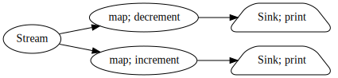
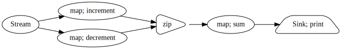
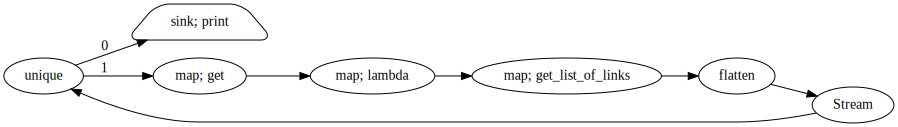

Core Streams
============

This document takes you through how to build basic streams and push data
through them.  We start with map and accumulate, talk about emitting data, then
discuss flow control and finally back pressure.  Examples are used throughout.

Map, emit, and sink
-------------------

.. currentmodule:: streamz

.. autosummary::
   Stream.emit
   map
   sink

You can create a basic pipeline by instantiating the ``Streamz``
object and then using methods like ``map``, ``accumulate``, and
``sink``.

.. code-block:: python

   from streamz import Stream

   def increment(x):
       return x + 1

   source = Stream()
   source.map(increment).sink(print)

The ``map`` and ``sink`` methods both take a function and apply that
function to every element in the stream.  The ``map`` method returns a
new stream with the modified elements while ``sink`` is typically used
at the end of a stream for final actions.

To push data through our pipeline we call ``emit``

.. code-block:: python

   >>> source.emit(1)
   2
   >>> source.emit(2)
   3
   >>> source.emit(10)
   11

As we can see, whenever we push data in at the source, our pipeline calls
``increment`` on that data, and then calls ``print`` on that data, resulting in
incremented results being printed to the screen.

Often we call ``emit`` from some other continuous process, like reading lines
from a file

.. code-block:: python

   import json

   data = []

   source = Stream()
   source.map(json.loads).sink(data.append)

   for line in open('myfile.json'):
       source.emit(line)

Accumulating State
------------------

.. autosummary::
   accumulate

Map and sink both pass data directly through a stream.  One piece of data comes
in, either one or zero pieces go out.  Accumulate allows you to track some
state within the pipeline.  It takes an accumulation function that takes the
previous state, the new element, and then returns a new state and a new element
to emit.  In the following example we make an accumulator that keeps a running
total of the elements seen so far.

.. code-block:: python

    def add(x, y):
        return x + y

    source = Stream()
    source.accumulate(add).sink(print)

.. code-block:: python

    >>> source.emit(1)
    1
    >>> source.emit(2)
    3
    >>> source.emit(3)
    6
    >>> source.emit(4)
    10

The accumulation function above is particularly simple, the state that we store
and the value that we emit are the same.  In more complex situations we might
want to keep around different state  than we emit.  For example lets count the
number of distinct elements that we have seen so far.

.. code-block:: python

   def num_distinct(state, new):
       state.add(new)
       return state, len(state)

    source = Stream()
    source.accumulate(num_distinct, returns_state=True, start=set()).sink(print)

    >>> source.emit('cat')
    1
    >>> source.emit('dog')
    2
    >>> source.emit('cat')
    2
    >>> source.emit('mouse')
    3

Accumulators allow us to build many interesting operations.

Flow Control
------------

.. autosummary::
   buffer
   flatten
   partition
   sliding_window
   union
   unique

You can batch and slice streams into streams of batches in various ways with
operations like ``partition``, ``buffer``, and ``sliding_window``

.. code-block:: python

   source = Stream()
   source.sliding_window(3, return_partial=False).sink(print)

   >>> source.emit(1)
   >>> source.emit(2)
   >>> source.emit(3)
   (1, 2, 3)
   >>> source.emit(4)
   (2, 3, 4)
   >>> source.emit(5)
   (3, 4, 5)

Branching and Joining
---------------------

.. autosummary::
   combine_latest
   zip
   zip_latest

You can branch multiple streams off of a single stream.  Elements that go into
the input will pass through to both output streams.  Note: ``graphviz`` and
``networkx`` need to be installed to visualize the stream graph.

.. code-block:: python

   def increment(x):
       return x + 1

   def decrement(x):
       return x - 1

   source = Stream()
   a = source.map(increment).sink(print)
   b = source.map(decrement).sink(print)
   b.visualize(rankdir='LR')

.. code-block:: python

   >>> source.emit(1)
   0
   2
   >>> source.emit(10)
   9
   11

Similarly you can also combine multiple streams together with operations like
``zip``, which emits once both streams have provided a new element, or
``combine_latest`` which emits when either stream has provided a new element.

.. code-block:: python

   source = Stream()
   a = source.map(increment)
   b = source.map(decrement)
   c = a.zip(b).map(sum).sink(print)

   >>> source.emit(10)
   20  # 9 + 11

This branching and combining is where Python iterators break down, and projects
like ``streamz`` start becoming valuable.

Processing Time and Back Pressure
---------------------------------

.. autosummary::
   delay
   rate_limit
   timed_window

Time-based flow control depends on having an active `Tornado
<http://www.tornadoweb.org/en/stable/>`_ event loop.  Tornado is active by
default within a Jupyter notebook, but otherwise you will need to learn at
least a little about asynchronous programming in Python to use these features.
Learning async programming is not mandatory, the rest of the project will work
fine without Tornado.

You can control the flow of data through your stream over time.  For example
you may want to batch all elements that have arrived in the last minute, or
slow down the flow of data through sensitive parts of the pipeline,
particularly when they may be writing to slow resources like databases.

Streamz helps you do these operations both with operations like ``delay``,
``rate_limit``, and ``timed_window``, and also by passing `Tornado
<http://www.tornadoweb.org/en/stable/>`_ futures back through the
pipeline.  As data moves forward through the pipeline, futures that signal work
completed move backwards.  In this way you can reliably avoid buildup of data
in slower parts of your pipeline.

Lets consider the following example that reads JSON data from a file and
inserts it into a database using an async-aware insertion function.

.. code-block:: python

   async def write_to_database(...):
       ...

   # build pipeline
   source = Source()
   source.map(json.loads).sink(write_to_database)

   async def process_file(fn):
       with open(fn) as f:
           for line in f:
               await source.emit(line)  # wait for pipeline to clear

As we call the ``write_to_database`` function on our parsed JSON data it
produces a future for us to signal that the writing process has finished.
Streamz will ensure that this future is passed all the way back to the
``source.emit`` call, so that user code at the start of our pipeline can await
on it.  This allows us to avoid buildup even in very large and complex streams.
We always pass futures back to ensure responsiveness.

But wait, maybe we don't mind having a few messages in memory at once, this
will help steady the flow of data so that we can continue to work even if our
sources or sinks become less productive for brief periods.  We might add a
``buffer``  just before writing to the database.

.. code-block:: python

   source.map(json.loads).buffer(100).sink(write_to_database)

And if we are pulling from an API with known limits then we might want to
introduce artificial rate limits at 10ms.

.. code-block:: python

    source.rate_limit(0.010).map(json.loads).buffer(100).sink(write_to_database)

Operations like these (and more) allow us to shape the flow of data through our
pipelines.

Modifying and Cleaning up Streams
---------------------------------

When you call ``Stream`` you create a stream.  When you call any method on a
``Stream``, like ``Stream.map``, you also create a stream.  All operations can
be chained together.  Additionally, as discussed in the section on Branching,
you can split multiple streams off of any point.  Streams will pass their
outputs on to all downstream streams so that anyone can hook in at any point,
and get a full view of what that stream is producing.

If you delete a part of a stream then it will stop getting data.  Streamz
follows normal Python garbage collection semantics so once all references to a
stream have been lost those operations will no longer occur.  The one counter
example to this is ``sink``, which is intended to be used with side effects and
will stick around even without a reference.

.. note:: Sink streams store themselves in ``streamz.core._global_sinks``.  You
          can remove them permanently by clearing that collection.

.. code-block:: python

   >>> source.map(print)      # this doesn't do anything
   >>> source.sink(print)     # this stays active even without a reference
   >>> s = source.map(print)  # this works too because we have a handle to s

Recursion and Feedback
----------------------

By connecting sources to sinks you can create feedback loops.
As an example, here is a tiny web crawler:

.. code-block:: python

   from streamz import Stream
   source = Stream()

   pages = source.unique()
   pages.sink(print)

   content = pages.map(requests.get).map(lambda x: x.content)
   links = content.map(get_list_of_links).flatten()
   links.connect(source)  # pipe new links back into pages

   >>> source.emit('http://github.com')
   http://github.com
   http://github.com/features
   http://github.com/business
   http://github.com/explore
   http://github.com/pricing
   ...

.. note:: Execution order is important here, as if the print was ordered after
          the ``map; get`` node then the print would never run.

Performance
-----------

Streamz adds microsecond overhead to normal Python operations.

.. code-block:: python

   from streamz import Stream

   source = Stream()

   def inc(x):
       return x + 1

   source.sink(inc)

   In [5]: %timeit source.emit(1)
   100000 loops, best of 3: 3.19 µs per loop

   In [6]: %timeit inc(1)
   10000000 loops, best of 3: 91.5 ns per loop

You may want to avoid pushing millions of individual elements per second
through a stream.  However, you can avoid performance issues by collecting lots
of data into single elements, for example by pushing through Pandas dataframes
instead of individual integers and strings.  This will be faster regardless,
just because projects like NumPy and Pandas can be much faster than Python
generally.

In the following example we pass filenames through a stream, convert them to
Pandas dataframes, and then map pandas-level functions on those dataframes.
For operations like this Streamz adds virtually no overhead.

.. code-block:: python

   source = Stream()
   s = source.map(pd.read_csv).map(lambda df: df.value.sum()).accumulate(add)

   for fn in glob('data/2017-*-*.csv'):
       source.emit(fn)

Streams provides higher level APIs for situations just like this one.  You may
want to read further about :doc:`collections <collections>`

Metadata
--------

Metadata can be emitted into the pipeline to accompany the data as a
list of dictionaries. Most functions will pass the metadata to the
downstream function without making any changes. However, functions
that make the pipeline asynchronous require logic that dictates how
and when the metadata will be passed downstream. Synchronous functions
and asynchronous functions that have a 1:1 ratio of the number of
values on the input to the number of values on the output will emit
the metadata collection without any modification. However, functions
that have multiple input streams or emit collections of data will emit
the metadata associated with the emitted data as a collection.

Reference Counting and Checkpointing
------------------------------------

Checkpointing is achieved in Streamz through the use of reference
counting. With this method, a checkpoint can be saved when and only
when data has progressed through all of the the pipeline without any
issues. This prevents data loss and guarantees at-least-once
semantics.

Any node that caches or holds data after it returns increments the
reference counter associated with the given data by one. When a node
is no longer holding the data, it will release it by decrementing the
counter by one. When the counter changes to zero, a callback
associated with the data is triggered.

References are passed in the metadata as a value of the `ref`
keyword. Each metadata object contains only one reference counter
object.
