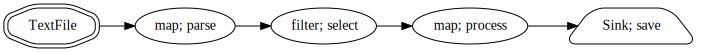
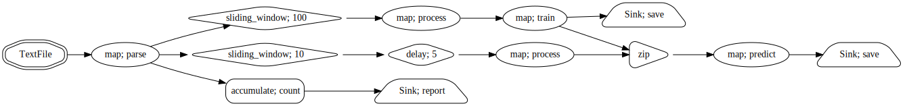

Streamz
=======

Streamz helps you build pipelines to manage continuous streams of data.  It is
simple to use in simple cases, but also supports complex pipelines that involve
branching, joining, flow control, feedback, back pressure, and so on.

Optionally, Streamz can also work with both `Pandas <https://pandas.pydata.org/pandas-docs/stable/reference/api/pandas.DataFrame.html>`_ and `cuDF <https://docs.rapids.ai/api/cudf/stable/>`_ dataframes, to provide sensible streaming operations on continuous tabular data.

To learn more about how to use streams, visit :doc:`Core documentation <core>`.

Motivation
----------

Continuous data streams arise in many applications like the following:

1.  Log processing from web servers
2.  Scientific instrument data like telemetry or image processing pipelines
3.  Financial time series
4.  Machine learning pipelines for real-time and on-line learning
5.  ...

Sometimes these pipelines are very simple, with a linear sequence of processing
steps:

And sometimes these pipelines are more complex, involving branching, look-back
periods, feedback into earlier stages, and more.

Streamz endeavors to be simple in simple cases, while also being powerful
enough to let you define custom and powerful pipelines for your application.

Why not Python generator expressions?
~~~~~~~~~~~~~~~~~~~~~~~~~~~~~~~~~~~~~

Python users often manage continuous sequences of data with iterators or
generator expressions.

.. code-block:: python

    def fib():
        a, b = 0, 1
        while True:
            yield a
            a, b = b, a + b

    sequence = (f(n) for n in fib())

However iterators become challenging when you want to fork them or control the
flow of data.  Typically people rely on tools like ``itertools.tee``, and
``zip``.

.. code-block:: python

    x1, x2 = itertools.tee(x, 2)
    y1 = map(f, x1)
    y2 = map(g, x2)

However this quickly become cumbersome, especially when building complex
pipelines.

Installation
------------

To install either use:

- conda-forge: ``conda install streamz -c conda-forge``
- pip: ``pip install streamz``
- dev: ``git clone https://github.com/python-streamz/streamz`` followed by ``pip install -e streamz/``

Quickstart
----------

The streamz project offers a Docker image for the convenience of quickly trying out streamz and its features. 
The purpose of the Dockerfile at this time is not to be used in a production 
environment but rather for experimentation, learning, or new feature development.

Its most common use would be to interact with the streamz example jupyter notebooks. Lets walk through the steps needed for this.

- Build the Docker container
.. code-block:: bash
$ docker/build.sh
- Run the Docker container
.. code-block:: bash
$ docker/run.sh
- Interact with Jupyter Lab on the container in your browser at `JUPYTER_LAB`_.
.. JUPYTER_LAB: http://localhost:8888/

Related Work
------------

Streamz is similar to reactive
programming systems like `RxPY <https://github.com/ReactiveX/RxPY>`_ or big
data streaming systems like `Apache Flink <https://flink.apache.org/>`_,
`Apache Beam <https://beam.apache.org/get-started/quickstart-py/>`_ or
`Apache Spark Streaming <https://spark.apache.org/streaming/>`_.

.. toctree::
   :maxdepth: 2
   :hidden:
   :caption: Contents

   core.rst
   dataframes.rst
   gpu-dataframes.rst
   dask.rst
   collections.rst
   api.rst
   collections-api.rst
   async.rst
   plotting.rst
